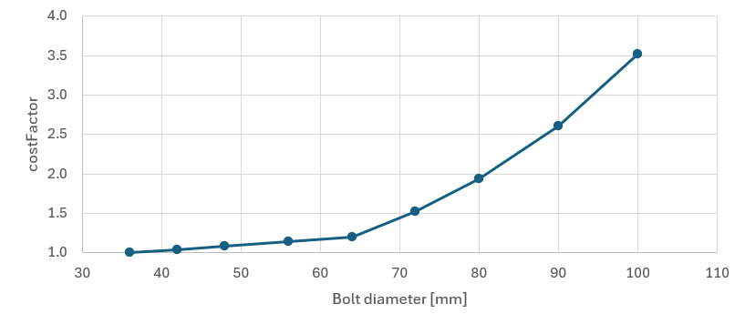
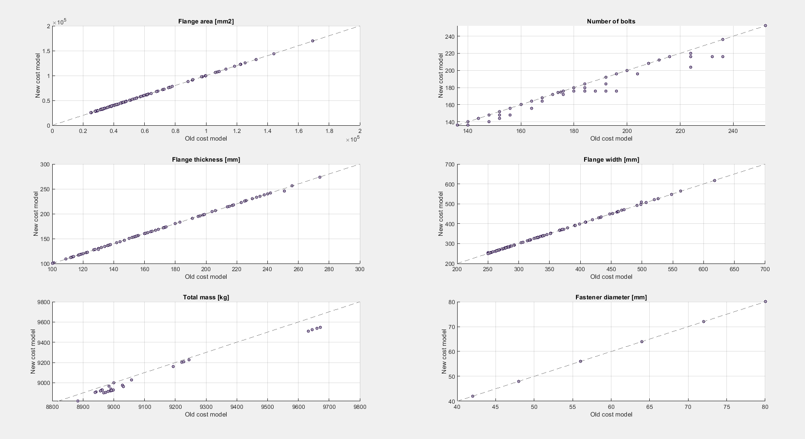
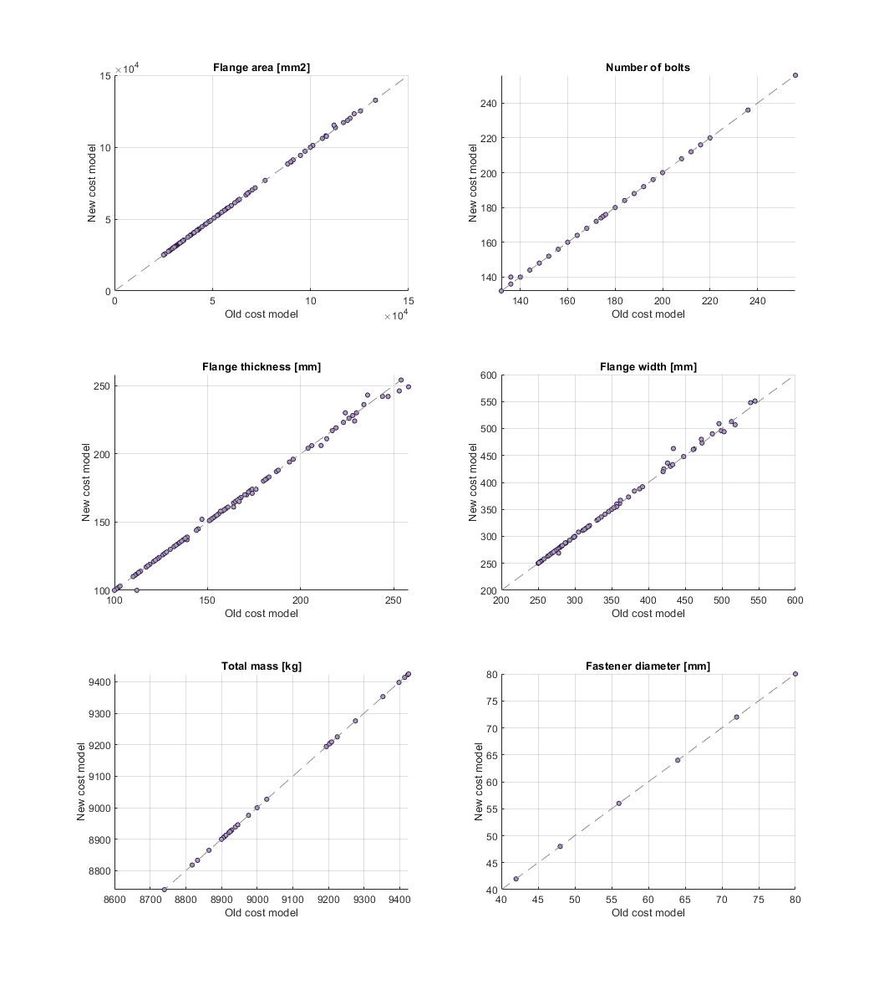

# Version notes

---

This document explains *significant* changes that were introduced by tool version updates.
Please note that other features or changes introduced with a specific version are not discussed here.

## 4.17.0

### Uneven T-flanges

It is no longer allowed to have a uneven `STEPSIZE_WIDTH` for T-flanges.
This means the default value of `1 [mm]` will now be `2 [mm]` for T flanges.

When an existing design with an uneven width is reran, this will trigger an error.
The width of the flange has to be a multiple of the `STEPSIZE_WIDTH`. This is not the case for uneven designs anymore

To solve this issue either:

- Increase the width of the existing flange by `1 mm`
- Use a prior version of USAIN

This will be fixed in the upcoming release of USAIN

## 4.13.0

### Out-of-memory issues

When the design inputs resulted in a large design space, it was known that USAIN could run into 'out-of-memory' issues.
In this version update there have been a few improvements which address the issues and improve the situation, allowing for larger design spaces.
There is a new input [`BOLT_DIAMETER_SELECTION`](../reference/expert-inputs.md#bolt_diameter_selection-string) which can be used to use the results of the ULS assessment to reduce the design space and proceed further calculations with only the three smallest feasible bolt sizes.
The fatigue assessment most often resulted in the 'out-of-memory' issues, the calculation steps are now updated which reduces the odds to run into the issue and furthermore improves speed.

### Simplified cost model

The simplified cost model introduced with the release of USAIN 4.0.0 had a dependency on the design space.
This dependency made it difficult to compare the "cost" of different flange designs, since it was not directly related to a physical description of the design.
In addition it could lead to a different "optimal design" when the newly introduced design space reduction method `BOLT_DIAMETER_SELECTION : uls` was used.

In USAIN 4.13.0 the cost model is simplified and now based on a physical description of the design.

The "cost" is now determined as:

<equation>
$\begin{align}
cost = costFactor \cdot (flangeMass + boltMass)
\end{align}$
</equation>

The costFactor is dependent on the bolt size as can be seen in underneath figure.

<figure>
  
</figure>

#### Impact of new cost model

In order to assess the impact of this change, a collection of 207 tower flanges have been redesigned, allowing changes in flange thickness, width, bolt size and number of bolts.
The following figures show scatter plots, comparing the old to the new cost model presented here.
From these figures it can be seen that design changes are minimal.
The most noticable differences are the total mass and the number of bolts, mostly observed for flanges higher up the tower.
With the new model a design with fewer bolts is often selected, as this results in a slightly lower total mass (flange plus fasteners) compared to the old model which would have a slightly lower flange mass (since there are more bolt holes) and the fasteners mass was not considered.

<figure>
  
  <figcaption>Cost model impact (click to enlarge)</figcaption>
</figure>

## 4.0.0

### Backwards incompatible changes

This major version increase (from 3.x to 4.x) is needed because some changes to the input file broke backwards compatibility.
In other words, USAIN 3.x input files no longer work with USAIN 4.x because of the following changes to the inputs:

- Input `diamOutFlange` is renamed to [`diamOutNeck`](../reference/inputfile.md#diamoutneck-number-optional).
- Input `Loads.inclinationAngle` split into [`Loads.inclinationValue`](../reference/inputfile.md#loadsinclinationvalue-number-optional) and [`Loads.inclinationUnit`](../reference/inputfile.md#loadsinclinationunit-string-optional).
- Input `PRELOAD_LOSS_FACTOR_FLS` split into [`BoltFls.PRELOAD_LOSS_FACTOR_FLS`](../reference/expert-inputs.md#boltflspreload_loss_factor_fls-number) and [`FlangeNeckScf.PRELOAD_LOSS_FACTOR_FLS`](../reference/expert-inputs.md#flangeneckscfpreload_loss_factor_fls-number).

### T-flange design improvements

The design rules-of-thumb for T-flanges are changed, as well as the use of inputs [`minFlangeWidth`](../reference/inputfile.md#minflangewidth-number-optional) and [`maxFlangeWidth`](../reference/inputfile.md#maxflangewidth-number-optional).

For a full description of the changes, please refer to [this explanations page](../explanation/t-flanges.md).

### Simplified cost model

The cost model in USAIN, used for finding the optimal flange design, is simplified.
Prior to this release, a complex cost model dating back to 2015 (the era of small flanges with HV bolts) was deemed heavily outdated and inaccurate.

In USAIN 4.0.0, the cost model is greatly simplified. The following three objectives are minimized using a weighted sum optimization:

- **Fastener diameter**: If realistically possible (considering the other objectives as well), a smaller bolt size is preferred from a cost, handling and installation perspective.
- **Flange thickness** and **flange width**: Two individual objectives, as optimizing for flange area was seen to give a preference for wider, thinner flanges. By specifying individual objectives for thickness and width, and corresponding weights, the preference can be steered towards thicker and less wide flanges.

Each objective, $f_i$, is normalized as follows:

<equation>
$\begin{align}
f_i^{norm}(x) = \frac{f_i(x) - \min(f_i(x))}{\max(f_i(x) - \min(f_i(x)))}
\end{align}$
</equation>

The objectives are normalized and weighed, with the option to change the weights through [expert inputs](../reference/expert-inputs.md).

!!! note inline end "Changing weights"

    Changing the weights is not advised, unless you know what you are doing and have consulted with the topic owner(s).

The objective function that is minimized can then be written as

<equation>
$\begin{align}
F(x) = \sum{w_i \cdot f_i^{norm}(x)}
\end{align}$
</equation>

#### Impact of new cost model

In order to assess the impact of this change, a collection of 151 MKVI (offshore) tower flanges have been redesigned, allowing changes in flange thickness, width, bolt size and number of bolts.
The following figures show scatter plots, comparing the complex (prior to USAIN 4.0.0) to the new cost model presented here.
From these figures it can be seen that design changes are minimal. Yet, the new cost model is considered an improvement as the optimization results from USAIN can be explained more easily.

<figure>
  
  <figcaption>Cost model impact (click to enlarge)</figcaption>
</figure>

## 3.8.0

### Multiple bolt fatigue assessments

!!! note inline end "For internal use only"

    The SGRE internal bolt force model may only be used internally and not for documentation purposes, e.g. to a certifier.
    Externally, only Schmidt-Neuper is to be used.

To assess bolt fatigue, USAIN has the option to use different bolt force models.
According to our Design Brief, following IEC 61400-6, bolt fatigue may only be assessed analytically using the Schmidt-Neuper bolt force model.
However, recent internal studies have shown that the result from Schmidt-Neuper may be too optimistic.
Internally, a new model (`sgre`) is developed and that should predict bolt fatigue life more realistically.

#### Implementation before 3.8.0

Prior to USAIN 3.8.0, assessing bolt fatigue for both the Schmidt-Neuper and SGRE bolt force models required multiple
USAIN runs (at least two).
This process is automated by functionality that allows the engineer to define multiple bolt fatigue assessments, with
different bolt force models, in a single USAIN run.

#### Impact of implementation

For full guidance on making full use of this feature, see [this dedicated how-to guide](../howto/multiple-bolt-fls.md).

To summarize the implications:

- Some input file fields have changed
- In a single USAIN run, you can now do as many bolt fatigue assessments as you like
- Only the first defined assessment is passed on to DOCTOR and will therefore be reported

??? question "Do I need to update my project?"

    The input file fields have changed for USAIN 3.8.0, but all USAIN 3.x.x input files are still supported.

    Nevertheless it is encouraged to keep input files up-to-date. This eases reviewing and is most transparent.
    See the how-to guide on [updating input files](../howto/update-inputfile.md) for support on updating your input files.
