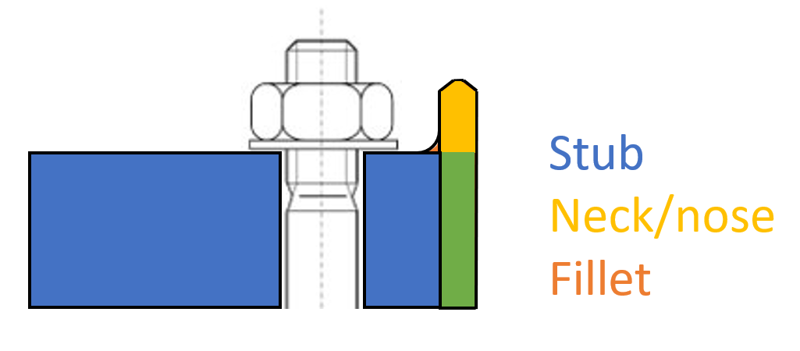

# Frequently Asked Questions

## General

### What does the acronym USAIN stand for?

*User interface for Stub Assemblies with Immense Nuts*. For more information have a look at the [Welcome page](../index.md).

### How should I use USAIN?

Please revert to the [Tutorials](../tutorials/index.md) for detailed descriptions on its usage.

### What to do when USAIN has memory issues?

Try to reduce the size of the design space, this can be done by tweaking your inputs. The most common options are listed underneath.
To include this reduction in your TEXACO run, please revert to the [Tutorials](../tutorials/texaco.md).

- reduce the amount of fastener options
- limit the range for the width and thickness
- limit the range for number of fasteners

### How to perform a check run with USAIN?

In short, ensure that you insert a single input to all variables related to the design space such that the design space will consist of a single point.

### How can I perform all flange designs for my support tower design without running TEXACO?

TEXACO makes use of the `USAIN batch runner`, which can also be used outside of TEXACO.
We currently have no documentation on how to operate this batch runner.
That will be added to this documentation in due time.
<!-- TODO Update answer and add link to USAIN batch runner page -->

### Why is "usain.ulsMeatLoafFilePath" in the TEXACO input?

MEATLOAF is a tool which calculates ULS loads.
If it's used within your TEXACO run, the output file where the ULS data will be stored is not readily known.
Therefore you can't specify the path directly in the USAIN base input file, but TEXACO needs to pass this on.
If used in your TEXACO run it is expected that the input will be `<VOID>`.

For details please revert to the [TEXACO tutorials](../tutorials/texaco.md)

<!-- TODO: Ideas for the FAQ
* What if USAIN throws a warning that the selected design is outside the calculated bounds?
 -->

### What is the Stub/Nose/Neck/Fillet for a flange?
{: style="height:250px"}

The green part does not have a name.

Although the neck and the nose refer to the same part, the term "neck" is preferred.


### How is the flange modelled in Structural Model?
The flange is modeled as a plate + a point mass. In above picture:

- The stub is modeled as the point mass in the Elems tab in StructuralModel. This point mass also takes the bolt masses into account.
- The neck and the green part are modeled as plate mass in the Plates tab in StructuralModel.
- The fillet is neglected

When running USAIN with a StructuralModel, USAIN will automatically update all relevant values in StructuralModel.


### What if I want to learn more about the design of flange connections?

The USAIN documentation tries to focus on operating and understanding USAIN only.
For technical background on flange design, there are a couple of places that you may want to check out:

1. [Design Brief - Support structure flange connections](https://siemensgamesa.sharepoint.com/:f:/r/teams/OG01069/Shared%20Documents/Design%20Briefs%20%26%20Rules/OFF/Design%20Briefs/Flanges){:target="_blank"}: described the design methodology we follow when designing support structure flange connections.
2. [Design Rules - Offshore Support Structures](https://siemensgamesa.sharepoint.com/:f:/r/teams/OG01069/Shared%20Documents/Design%20Briefs%20%26%20Rules/OFF/Design%20Rules/OF_SUS){:target="_blank"}: an SGRE internal document that provides guidance for the design engineer.
3. The technology owner: [Frits Wenneker](mailto:frits.wenneker@siemensgamesa.com)
4. The oracle: The one and only [Marc Seidel](mailto:marc.seidel@siemensgamesa.com)

### How do I select IHF RoundNuts for my design?

In USAIN, tension tightened connection are always fitted with round nuts (on both sides, in case of studs).
By default, USAIN will assume ISR nuts because these components are preferred.
If you need/want to use IHF RoundNuts, you can do so with the expert input [`ROUND_NUT_TYPE`](../reference/expert-inputs.md#round_nut_type-string) (click the link for more info).

### Why do I get an error message about an invalid combination of bolt options and temporary stages tool?

USAIN won't allow you to combine all bolt options with all tightening tools and/or temporary stages tools.
Some combinations should not be used in practice and is therefore excluded to avoid that this might be used in a design by accident.
As an example, ISO_M80 studs is only allowed in combination with `thin` temporary stages tools.

=== "Invalid scenario"

    ```text
    boltOptions             : ISO_M80
    TEMP_STAGES_TOOL_TYPE   : normal (=default)
    ```
    This will result in an error.

=== "Valid scenario"

    ```text
    boltOptions             : ISO_M80
    TEMP_STAGES_TOOL_TYPE   : thin
    ```
    This is a valid combination and will run ok.
