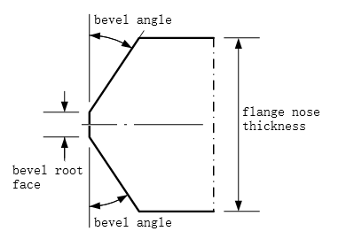

# Expert inputs

This section describes *expert inputs* that can be added to the USAIN input file.

!!! important "Use expert inputs with care"

    * All expert inputs are optional; default values will be used if an expert input is not explicitly defined in an input file
    * All inputs parameters written in `CAPITALS_WITH_UNDERSCORES`
    * By default, these inputs are not shown in USAIN input files. Modifying expert inputs may have an impact on the validity of the tool run (e.g. by means of Design Brief violations or infeasible tolerance definitions). Use with care!

The input file has the following expert input field groups:

- [Design space](#design-space)
- [Bolt related](#bolt-related)
- [Door segment](#door-segment)
- [Loads](#loads)
- [Miscellaneous](#miscellaneous)
- [Tolerances and allowances](#tolerances-and-allowances)
- [Material properties](#material-properties)
- [Partial safety factors](#partial-safety-factors)
- [FLS assessment](#fls-assessment)
- [ULS assessment](#uls-assessment)
- [Bolt thread requirements](#bolt-thread-requirements)
- [Design conditions](#design-conditions)

## Design space

For the regular inputs in this section, see the [input file description page](./inputfile.md#design-space).

#### `STEPSIZE_NBOLTS`: number

:   Mesh size for design space variable "number of bolts".

    Default: 4

#### `STEPSIZE_WIDTH`: number

:   Mesh size for design space variable "flange width".

    Units: [mm].

    Default: 1

#### `STEPSIZE_THICKN`: number

:   Mesh size for design space variable "flange thickness".

    Units: [mm].

    Default: 1

#### `GLOBAL_MIN_BOLT_DISTANCE `: number

:   Minimum distance between bolts to trim the internally calculated design bounds.

    Units: [mm].

    Default:

#### `GLOBAL_MAX_BOLT_DISTANCE `: number

:   Maximum distance between bolts to trim the internally calculated design bounds.

    Units: [mm].

    Default:

#### `MIN_NUMBER_BOLTS_FRACTION`: number

:   This value indicates which fraction of the maximum number of bolts to use as the minimum number of bolts in the design space.

    Default: 0.9

    Reducing this parameter leads to reduced gap closing capacity and is therefore not preferred.
    Legacy onshore designs use a value of 0.5, so the possibility to change the minimum is given with this input parameter.

#### `DO_TRIM_DESIGN_SPACE`: boolean

:   Toggle to have USAIN trim design space variables from user input to internally calculated bounds, potentially reducing the design space.
    If set to `false`, the user specified input design space will be considered even if this is potentially infeasible.
    Also see [`DO_UPDATE_DESIGN_SPACE`](./expert-inputs.md#doupdatedesignspace-boolean)

    Default: `true`

#### `DO_UPDATE_DESIGN_SPACE`: boolean

:   Toggle to indicate if USAIN should continuously update the design space after each design condition verification, i.e. remove infeasible design points.
    When no feasible points exist, the "best infeasible" point will be used for the remaining run.
    When set to `false` the design space will not be reduced. This increases the chance of running into out-of-memory issues.

    Default: `true`

#### `BOLT_DIAMETER_SELECTION`: string

:   Allows for additional design space reduction based on ULS failure mode assessment.

    Choose from: `all`, `uls`

    Default: `all`

    When set to `all`, bolt diameter selection is not performed.

    When set to `uls`, an attempt of reducing the design space will be done after evaluating the ULS condition.
    The ULS assessment is used to determine the minimum required bolt size, and continue the run with that bolt size, plus two sizes bigger.
    If either or both inputs [`DO_UPDATE_DESIGN_SPACE`](./expert-inputs.md#doupdatedesignspace-boolean) and [`DO_ASSESS_ULS`](./expert-inputs.md#do_assess_uls-boolean) are disabled, this input is ignored.

    It is not allowed to use multiple bolt series for input [`boltOptions`](./inputfile.md#boltoptions-list-of-strings) (e.g. HV and ISO), when this input is set to `uls`.

    ??? info "How does this work (example)"

        Given input [`boltOptions`](./inputfile.md#boltoptions-list-of-strings) set to `ISO_M36`, `ISO_M42`, `ISO_M48`, `ISO_M64`, `ISO_M72`, and [`BOLT_DIAMETER_SELECTION`](./expert-inputs.md#boltdiameterselection-string) set to `uls`.

        After evaluating ULS the following is done, the smallest bolt diameter for which the ULS condition is feasible is determined.

        * If this is M36, continue USAIN process with M36, M42 and M48 only. Reduction is performed based on the input `BOLT_DIAMETER_SELECTION` set to `uls`.
        * If this is M42, continue USAIN process with M42, M48 and M56 only. Reduction is performed based on the input `BOLT_DIAMETER_SELECTION` set to `uls`.
        * If it is M48, continue with M48, M64 and M72. Reduction is performed based on the input `DO_UPDATE_DESIGN_SPACE` set to `true`.
        * If it is M64, continue with M64 and M72. Reduction is performed based on the input `DO_UPDATE_DESIGN_SPACE` set to `true`.
        * If it is M72, continue with M72. Reduction is performed based on the input `DO_UPDATE_DESIGN_SPACE` set to `true`.

## Bolt related

For the regular inputs in this section, see the [input file description page](./inputfile.md#bolt-related).

#### `NUT_TYPE`: string

:   Type of nut to be added to fastener assembly.
    This input may be used to specify an IHF RoundNut when input [`tighteningMethod`](./inputfile.md#tighteningmethod-string-required) is set to `tension`.

    Choose from: `HV`, `JIS`, `IHF`, `ISO`, `ISR`

    For differences between `ISR` and `IHF` round nuts, see the [Fastener properties](./fastener-props.md) reference page.

    Default: `ISR` when input [`tighteningMethod`](./inputfile.md#tighteningmethod-string-required) is set to `tension`.
    For `torque`, a hexagon nut of the same series as the [`boltOptions`](./inputfile.md#boltoptions-list-of-strings) is assumed.

#### `TEMP_STAGES_TOOL_TYPE`: string

:   Tool (torque socket) type used for temporary stages (e.g. pre-assembly).
    The tools used during temporary stages impact the bolt distance.
    Select `none` in case USAIN should not consider the temporary stages tool to impact the bolt distance.

    Choose from: `normal`, `thin`, `none`

    Default: `normal`

#### `B_MIN`: number

:   The distance from the flange upper nose mean diameter to the inner bolt center diameter, also referred to as the flange outer width, is indicated with parameter "b".
    USAIN determines the bolt circle diameter by calculating a minimum required value for "b" for multiple criteria, for example the distance from the installation tool to the tower wall.
    The driving criteria, i.e. the one with the largest minimum value for "b", will dictate the actual bolt circle diameter.

    This input `B_MIN` can be used to set an additional requirement to be considered to determine the bolt circle diameter.

    Units: [mm]

    If not set, the default for each bolt option will be used.
    Otherwise, specify either single value or one for each bolt option.

#### `TOOL_DIMENSION_CIRC_DIR`: number

:   Override of tightening tool size in circumferential direction (i.e. towards the neighboring bolt).

    Units: [mm]

    If not set, the default for each bolt option will be used.
    Otherwise, specify either single value or one for each bolt option.

    The size is measured from center of bolt to edge of tool.
    For a round torque tool socket, this is simply the socket radius.

#### `TOOL_DIMENSION_RADIAL_DIR`: number

:   Override of tightening tool size in radial direction (i.e. towards the wall/neck).

    Units: [mm]

    If not set, the default for each bolt option will be used.
    Otherwise, specify either single value or one for each bolt option.

    The size is measured from center of bolt to edge of tool.
    For a round torque tool socket, this is simply the socket radius.

<figure>
  <a target="_blank" href="img/tools-on-bolt-circle-diam.svg">
    
  </a>
  <figcaption>Circular and non-circular tools on the bolts of a flange connection</figcaption>
</figure>

## Door segment

The following inputs are part of this section.

=== "Input parameters"

    ```yaml
    DOOR_SEGMENT.DO_INCLUDE            :
    DOOR_SEGMENT.THICKNESS             :
    DOOR_SEGMENT.MIN_CAN_TO_DOOR_DELTA_THICKNESS   :
    DOOR_SEGMENT.FACTOR_CAN_TO_DOOR_THICKNESS      :
    ```

=== "Without door segment"

    ```yaml
    DOOR_SEGMENT.DO_INCLUDE            : false
    DOOR_SEGMENT.THICKNESS             :
    DOOR_SEGMENT.MIN_CAN_TO_DOOR_DELTA_THICKNESS   :
    DOOR_SEGMENT.FACTOR_CAN_TO_DOOR_THICKNESS      :
    ```

=== "With door segment"

    ```yaml
    DOOR_SEGMENT.DO_INCLUDE            : true
    DOOR_SEGMENT.THICKNESS             : 100
    DOOR_SEGMENT.MIN_CAN_TO_DOOR_DELTA_THICKNESS   :
    DOOR_SEGMENT.FACTOR_CAN_TO_DOOR_THICKNESS      :
    ```

!!! question "What if there is an additional can between the door segment and the flange?"

    In this scenario USAIN does not need to consider the thick plate from the door segment in the bolt circle diameter and therefore the inputs have to be set to reflect the situation *without door segment*.

#### `DOOR_SEGMENT.DO_INCLUDE`: boolean, optional

:   Toggle to consider a door segment in the bolt circle diameter calculations.

    Valid values: `true`, `false`, `1`, `0` (default is `false`)

#### `DOOR_SEGMENT.THICKNESS`: number, optional

:   Thickness of the door segment plate.

    Units: [mm]

    If not set, logic based on the door segment design guide will be used to get an expected estimate.
    The logic can be manually influenced, using the expert inputs below.
    The resulting value is taken as the condition leading to the largest thickness.


    === "Minimum delta thickness governing"

        ```text
        surrounding can thickness = 50 mm
        DOOR_SEGMENT.MIN_CAN_TO_DOOR_DELTA_THICKNESS   : 20     -> assumed thickness = 70mm
        DOOR_SEGMENT.FACTOR_CAN_TO_DOOR_THICKNESS      : 1.3    -> assumed thickness = 65mm

        Hence 70mm will be taken into account as expected thickness.
        ```

    === "Factor on thickness governing"

        ```text
        surrounding can thickness = 100 mm
        DOOR_SEGMENT.MIN_CAN_TO_DOOR_DELTA_THICKNESS   : 20     -> assumed thickness = 120mm
        DOOR_SEGMENT.FACTOR_CAN_TO_DOOR_THICKNESS      : 1.3    -> assumed thickness = 130mm

        Hence 130mm will be taken into account as expected thickness.
        ```

#### `DOOR_SEGMENT.MIN_CAN_TO_DOOR_DELTA_THICKNESS`: number

:   Minimum thickness jump between the surrounding can and the door segment plate.

    Units: [mm].

    Default: 20


#### `DOOR_SEGMENT.FACTOR_CAN_TO_DOOR_THICKNESS`: number

:   Factor applied on the surrounding can thickness to estimate the door segment plate thickness.

    Default: 1.3

## Loads

For the regular inputs in this section, see the [input file description page](./inputfile.md#loads).

#### `DEAD_WEIGHT`: number

:   Dead weight (normal force), characteristic value.

    Units: [kN].

    Default:

    This expert input may only be used if no StructuralModel is provided for input [`structureInpFilePath`](./inputfile.md#structureinpfilepath-full-file-path).
    If both are defined, an error will be raised.

    A non-negative number is expected, because the positive z-axis is pointing downwards.
    The design value is computed by multiplication with input [`PSF_FAVORABLE_LOADS`](#psf_fav_loads-number).
    Only relevant for ULS assessments.

#### `INCLINATION_MOMENT`: number

:   Inclination moment, characteristic value.

    Units: [kNm].

    Default:

    A non-negative number is expected.
    The design value is computed by multiplication with a factor 1.1 (PSF for gravity) since it's an unfavorable contribution.
    Only relevant for ULS and SLS assessments.

#### `INCLINATION_MOMENT_FLS`: number

:   Inclination moment for FLS assessments, characteristic value.

    See also: [`INCLINATION_MOMENT`](#inclination_moment-number).
    The only difference is that this input is used for FLS assessments.

#### `ULS_BENDING_MOMENT`: number

:   Bending moment for ULS design conditions, design value.

    Units: [kNm]

    Default:

    This expert input may only be used if no ULS related inputs are provided in the "Loads" input group. If both are defined an error will be raised.

    Scaling factors defined in input [`Loads.ulsScalingFactor`](./inputfile.md#loadsulsscalingfactor-vector-of-numbers-optional) and any SCF from [`MACRO_GEOMETRIC_SCF`](#macro_geometric_scf-number) are not applied to this input value.

    Only relevant for ULS assessments.

    Note: the FLS related inputs from the "Loads" group are still considered when an FLS assessment is performed.

#### `S1_BENDING_MOMENT`: number

:   Override for S1 bending moment for SLS design conditions, design value.

    Units: [kNm]

    Min value: `0`

    Max value: `1000000`

    If this expert input is set, any S1 loads that are provided under [`Loads.S1FilePath`](./inputfile.md#loadss1filepath-full-file-path-optional) will be ignored.

    Scaling factors defined in input [`Loads.S1ScalingFactor`](./inputfile.md#loadss1scalingfactor-vector-of-numbers-optional) and any SCF from [`MACRO_GEOMETRIC_SCF`](#macro_geometric_scf-number) are not applied to this input value.

    This only affects SLS, hence the FLS and ULS related inputs from the "Loads" group are still considered for FLS and ULS assessments.

#### `Loads.ALIGN_AT`: string

:   Align loads to resolve the potential mismatch between the structure length in the loads file and to be designed structure.

    Units: [m]

    Choose from: `towertop`, `interface`

    Default: `interface`

    Select `towertop` if you want to align loads with respect to tower top.
    Select `interface` if you want to align loads with respect to interface.

    This expert input has no effect when the structure length in the loads file is equal to the to be designed structure.

## Miscellaneous

For the regular inputs in this section, see the [input file description page](./inputfile.md#miscellaneous).

#### `CUSTOM_WASHER_DIAM_INNER`: number

:   Inner diameter of custom washer.

    Units: [mm].

    If not set, default washers are considered. Otherwise, specify either single value or one for each bolt option.

#### `CUSTOM_WASHER_DIAM_OUTER`: number

:   Outer diameter of custom washer.

    Units: [mm].

    If not set, default washers are considered. Otherwise, specify either single value or one for each bolt option.

#### `CUSTOM_WASHER_THICKNESS`: number

:   Thickness of custom washer.

    Units: [mm].

    If not set, default washers are considered. Otherwise, specify either single value or one for each bolt option.

#### `STEPSIZE_BOLT_EXT_LEN`: number

:   Step size in bolt extender lengths

    Units: [mm].

    Default: 1

#### `SECONDARY_HOLES_BCD`: number

:   Bolt circle diameter of secondary (vertical) holes in the flange (e.g. for platform stays).

    Units: [mm].

    If not set, no secondary holes will be considered.

#### `SECONDARY_HOLES_DIAMETER`: number

:   Bolt hole diameter of secondary (vertical) holes in the flange (e.g. for platform stays).

    Units: [mm].

    If not set, no secondary holes will be considered.

#### `BEVEL_ANGLE`: number

!!! important inline end "Bevel geometry"

    The calculations on the bevel geometry, as specified by `BEVEL_ANGLE` and `BEVEL_ROOT_FACE`, are only valid for
    a symmetric (also known as double-V) bevel cut geometry. Other bevel geometries are not supported. The symmetric
    bevel geometry is  shown in the figure.

    Currently onshore design and offshore design use a different default value for `BEVEL_ANGLE`. For every design
    the default values for `BEVEL_ANGLE` and `BEVEL_ROOT_FACE` should be specified via the platform specific Design
    Guide.

:   Bevel cut angle.

    Units: [deg].

    Default: 42

#### `BEVEL_ROOT_FACE`: number

:   Thickness of part of flange that does not have a bevel cut.

    Units: [mm].

    Default: 4

<figure>
  <a target="_blank" href="img/bevel_cut_geometry.png">
    
  </a>
  <figcaption>Bevel cut geometry</figcaption>
</figure>

#### `FILLET_RADIUS`: number

:   Radius of fillet between flange nose and stub.

    ??? info "Automatic switch from L- to T-flange?"

        See the [automatic switch from L- to T-flange](../explanation/t-flanges.md#automatic-switch-from-l-flange-to-t-flange) section to see how this inputs will be manipulated if such a switch is perfomed.

    Units: [mm].

    Default: 10

#### `MIN_NOSE_HEIGHT`: number

:   Minimum nose height of flange.

    Units: [mm].

    Default: 40

#### `CLEARANCE_FILLET_WELD`: number

:   Required clearance between end of fillet and begin of weld prep.

    Units: [mm].

    Default: 20

    This value, together with a 10mm fillet radius, is to account for enough distance from stress disturbing effects at the flange/fillet/neck area.
    Also for grinding the inside of the neck weld (DC112), this is believed to be enough to avoid damaging the fillet radius during the process of grinding the weld flush.

#### `MAX_WELD_BULGE_SIZE`: number

:   Maximum bulge size of weld between flange nose and adjacent shell.

    Units: [mm].

    Default: 5

#### `ADDITIONAL_SCF_FLS`: number

:   Additional SCF for bolt fatigue assessments.

    Default: 1.0

    This SCF applies to fatigue assessments (on fasteners) and is applied on stresses.
    Note that this factor is not applied on the flange neck bending stresses.

    !!! info "Legacy input"

        Generally, using this input is not advised.
        See the explanation page on [SCFs and load scaling](../explanation/scfs-and-load-scaling.md) for more info.

#### `ADDITIONAL_SCF_ULS`: number

:   Additional SCF for ULS assessments.

    Default: 1.0

    This SCF applies to ULS only (fasteners and flange material).
    Use with care; one could argue that stresses will redistribute under extreme loading conditions and stress concentrations might not occur or are less prominent compared to FLS.

#### `MACRO_GEOMETRIC_SCF`: number

:   Factor to account for macro-geometric effects (e.g. stiffening effect of the door openings / jacket legs).

    Default: 1.0

    This factor is applied on the loads directly. That is, on the means and ranges of a Markov matrix.
    The macro-geometric SCF is applied on the dead weight as well (i.e. making dead weight more favorable for SCFs > 1.0).
    This is done to ensure, for example, that for zero external load the SGRE2.0 bolt force curve returns exactly the preload.

    !!! info "Macro-geometric effects can lead to local increases of flange loading"
        Examples of macro-geometric effects are:

        - Door openings: Large cut-outs are leading to local stress increases near the edges of the opening.
        - Jacket legs: Transition pieces from jackets with three or four legs often have higher stiffness at the locations where the jackets legs are transitioning into the cylindrical tower shape.

#### `REACTION_DISTANCE_METHOD`: string

:   Method for correction factor of reaction force application distance (referred to as "a'" in literature).

    Default: `tobinaga`

    Choose from: `tobinaga`, `seidel`

    The reaction distance method affects ULS and flange neck SCF calculations.

#### `PLOT_STRESS_TRANSFER_FUNCS`: boolean

:   Toggle to show plots of flange neck stress depending on load levels.

    Default: `false` (by default, this is turned of because it slows down USAIN)

#### `PLOT_STRESS_PATHS`: boolean

:   Toggle to show plots of flange neck SCFs along wall.

    Default: `false` (by default, this is turned of because it slows down USAIN)

#### `TIGHTENING_SIDE_INSTALLATION`: string

:   Application side of the tightening tool for installation.

    Default: `upper`

    Choose from: `upper`, `lower`

    The tightening side for installation affects the calculation of the bolt circle diameter and the check if the tool would clash with the wall of the structure.
    Note that this input will also determine the orientation of the fastener and therefore only allows the options `upper` or `lower`, not 'both'.

#### `TIGHTENING_SIDE_TEMP_STAGES`: string

:   Application side of the tightening tool for temporary stages.

    Default: `both`

    Choose from: `upper`, `lower`, `both`

    The tightening side for temporary stages affects the calculation of the bolt circle diameter.

#### `DO_SAVE_FULL_FILE`: boolean

:   Toggle to save all calculated data or only the required output data needed for reporting.

    Default: `false` (because it will suffice for reporting and therefore reduces data storage and improves speed)

#### `DO_ALLOW_SWITCH_L_TO_T`: boolean

:   Toggle to allow USAIN to switch to a T-flange when no feasible L-flange can be designed.

    Default: `false`

## Tolerances and allowances

This section lists the various tolerances and allowances considered in USAIN, which can be modified.

- Allowance: Planned deviation from design value
- Tolerance: Limit of acceptable, unintended deviation from design value + allowance

#### `TOL_BCD`: number

:   Tolerance for bolt circle diameter.

    Units: [mm].

    Default: 4

#### `TOL_BCD_TOOL_WALL`: number

:   Tolerance for bolt circle diameter, specifically for the collision check between (tension) tool and (tower) wall.

    Units: [mm].

    Default: 4

    For the BCD check to avoid collision between (tension) tool and (conical tower) wall, the lower value for [TOL_BCD](#tol_bcd-number) is deemed unsafe: it may not be sufficient to cover a stack-up of plate misalignment, cone angle tolerances, bolt hole position, etc.

#### `TOL_FLANGE_WIDTH`: number

:   Tolerance on flange width.

    Units: [mm].

    Default: 2

#### `TOL_FLANGE_THICKNESS_MINUS`: number

:   Tolerance on flange thickness; the limit of acceptable, unintentional deviation from the nominal value.
    The "minus" indicates that the deviation is in negative direction, hence resulting in a thinner flange.
    Note: this value does not impact the flange design in USAIN.
    The design calculations use the "design thickness" as minimum possible value of the flange thickness.
    The input value is directly related to the requirements on the flange drawings.
    This input is related to the inputs [ALW_UPPER_FLANGE_THICKNESS](#alw_upper_flange_thickness-number) and [ALW_LOWER_FLANGE_THICKNESS](#alw_lower_flange_thickness-number).
    The value for the tolerance must always be less or equal to the allowances.

    Units: [mm].

    Default: 2

#### `TOL_FLANGE_THICKNESS_PLUS`: number

:   Tolerance on flange thickness; the limit of acceptable, unintentional deviation from the nominal value.
    The "plus" indicates that the deviation is in positive direction, hence resulting in a thicker flange.

    Units: [mm].

    Default: 2

#### `TOL_EXTENDER_LENGTH`: number

:   Tolerance on bolt extender length.

    Units: [mm].

    Default: 0.5

#### `TOL_FILLET_RADIUS_PLUS`: number

:   'Plus' tolerance on fillet radius.
    Note that a 'minus' variant of the fillet radius tolerance is not allowed in USAIN and therefore not present.

    Units: [mm].

    Default: 1

#### `TOL_BOLT_HOLE`: number

:   Tolerance on bolt hole diameter.

    Units: [mm].

    Default: 0.5

#### `ALW_UPPER_FLANGE_THICKNESS`: number

:   Machining allowance on upper flange thickness.
    This allowance is not used in design condition assessments, but it is used in thread length checks and mass calculations.
    Note: this input is related to input [TOL_FLANGE_THICKNESS_MINUS](#tol_flange_thickness_minus-number).
    The value for the allowance must always be greater or equal than the tolerance.

    Units: [mm].

    Default: 2

#### `ALW_LOWER_FLANGE_THICKNESS`: number

:   Machining allowance on lower flange thickness.
    This allowance is not used in design condition assessments, but it is used in thread length checks and mass calculations.
    Note: this input is related to input [TOL_FLANGE_THICKNESS_MINUS](#tol_flange_thickness_minus-number).
    The value for the allowance must always be greater or equal than the tolerance.

    Units: [mm].

    Default: 2

#### `RADIUS_SHIFT_SHELL`: number

:   Radius shift applied in flange neck SCF calculations, representing unintended misalignment at the weld of the upper flange.

    Units: [mm].

    Default: 0

    Inverted value applied to lower flange, i.e. if this input is set to 1mm the lower flange will get -1mm assigned.

#### `RADIUS_SHIFT_FLANGE`: number

:   Radius shift applied in flange neck SCF calculations, representing relative shifting of flanges (e.g. for enlarged bolt holes).

    Units: [mm].

    Default: 0

    Inverted value applied to lower flange, i.e. if this input is set to 1mm the lower flange will get -1mm assigned.

## Material properties

#### `E_BOLT`: number

:   Elastic modulus for bolt material.

    Units: [GPa].

    Default: 210

#### `E_FLANGE`: number

:   Elastic modulus for flange material.

    Units: [GPa].

    Default: 210

#### `RHO_FLANGE`: number

:   Density of flange material (also used from bolt extender).

    Units: [kg/m3].

    Default: 7850

#### `FLANGE_STEEL_TYPE`: string

:   Steel type of flange (to determine flange yield strength).

    Default: S355

## Partial safety factors

#### `PSF_BOLT_RESISTANCE`: number

:   Partial safety factor on tension resistance of bolt.

    Default: 1.25

    For a robustness check, this PSF will be forced to 1.00 internally. For more information, see the [robustness check reference page](#404).

<!--TODO: - Link to robustness page-->

#### `PSF_BOLT_RESISTANCE_JPN_TAG`: string

:   Loads tag to indicate different subsets to set the PSF on bolt tension resistance (F,tRd), for JPN designs.

    Default: shortTerm longTerm seismic

    For more information, see the [Japanese specific inputs page](../reference/Japan-design.md).

#### `PSF_BOLT_RESISTANCE_JPN`: number

:   PSF on bolt tension resistance (F,tRd), for each loads tag in PSF_BOLT_RESISTANCE_JPN_TAG.

    Default: 1.25      1.875    1.0

    For more information, see the [Japanese specific inputs page](../reference/Japan-design.md).

#### `PSF_FAVORABLE_LOADS`: number

:   Partial safety factor on favorable loads (gravity).

    Default: 0.9.

#### `PSF_FLANGE_MATERIAL_FLS`: number

:   Partial safety factor for material strength (for flange neck SCF assessment).

    Default: 1.25

#### `PSF_MATERIAL_ULS`: number

:   Partial safety factor for material strength (ULS checks).

    Default: 1.10

    For a robustness check, this PSF will be forced to 1.00 internally. For more information, see the [robustness check reference page](#404).

<!--TODO: - Link to robustness page-->

#### `PSF_CMPCLASS2_FLS`: number

:   Partial safety factor on consequence of failure (FLS checks).

    Default: 1.00

#### `PSF_CMPCLASS2_ULS`: number

:   Partial safety factor on consequence of failure (ULS checks).

    Default: 1.00

    For a robustness check, this PSF will be forced to 1.00 internally. For more information, see the [robustness check reference page](#404).

<!--TODO: - Link to robustness page-->

## FLS assessment

#### `BoltFls.BOLT_FORCE_MODEL`: string

:   Bolt force model to be used for fatigue assessment.

    !!! info inline end "Bolt fatigue assessment"

        Bolt fatigue assessment inputs are grouped in a `BoltFls` block.

        When these expert inputs are used, it's required to define all related inputs of this block.

        To define multiple bolt fatigue assessments, copy/paste this entire block.

        The order of defining the `BoltFls` input blocks is important!

        Only the first input block will be stored in the output .usn file, and therefore this defines the FLS assessment that will be reported by DOCTOR.

        See [the how-to page](../howto/multiple-bolt-fls.md) for details.

        See the [automatic switch from L- to T-flange](../explanation/t-flanges.md#automatic-switch-from-l-flange-to-t-flange) section to see how the `BoltFls` inputs will be manipulated if such a switch is perfomed.

    Default: `schmidtneuper`

    Choose from: `schmidtneuper`, `sgre2`, `petersen`

    Setting this value to `petersen` is only allowed when designing T-flanges.

#### `BoltFls.CUSTOM_PRELOAD`: number

:   Custom pretension value (nominal preload $F_{V}$).

    Units: [kN].

    If not set, default values are applied as described in [preload selection](../howto/multiple-bolt-fls.md#preload-selection).
    Otherwise, specify one for each bolt option.

    For FLS assessments, USAIN will reduce the *nominal preload* with a factor specified by expert input [`BoltFls.PRELOAD_LOSS_FACTOR_FLS`](#boltflspreload_loss_factor_fls-number) to cover for long-term losses.

#### `BoltFls.PRELOAD_LOSS_FACTOR_FLS`: number

:   Reduction factor on nominal preload $F_{V}$, for fatigue assessments.

    Default: 0.90

    The reduction of the intended preload is meant to cover long term preload losses.

    The preload loss factor is applied to the [`BoltFls.CUSTOM_PRELOAD`](#boltflscustom_preload-number) if specified,
    or to the default *nominal preload* values otherwise.

    !!! warning "Use with caution"
        Using a non-default value may affect the service strategy and hence requires alignment with the project organization.

#### `BoltFls.PSF_BOLT_MATERIAL_FLS`: number

:   Partial safety factor for material strength (for bolt FLS assessment).

    Default: As per recommendations below.

    Recommended values are as follows:

    * When [`BoltFls.BOLT_FORCE_MODEL`](#boltflsbolt_force_model-string) is `sgre2`, the default is 1.10 (according to IEC 61400-6/AMD1).
      For input blocks with this bolt force model, 1.10 is assigned if it is not set in the input file.

    * When [`BoltFls.BOLT_FORCE_MODEL`](#boltflsbolt_force_model-string) is `schmidtneuper` or `petersen`, the default is 1.25.
      For input blocks with these bolt force models, 1.25 is assigned if it is not set in the input file.

#### `BoltFls.SN_CURVE_BOLT`: string

:   S-N curve for bolt fatigue assessment.

    Default: As per recommendations below.

    Recommended values are as follows:

    * When [`BoltFls.BOLT_FORCE_MODEL`](#boltflsbolt_force_model-string) is `sgre2`, the default is `EC3_DC50`.
      For input blocks with this bolt force model, `EC3_DC50` is assigned if it is not set in the input file.

    * When [`BoltFls.BOLT_FORCE_MODEL`](#boltflsbolt_force_model-string) is `schmidtneuper` or `petersen`, the default is `EC3_DC36*`.
      For input blocks with these bolt force models, `EC3_DC36*` is assigned if it is not set in the input file.

    For assessments where [`BoltFls.BOLT_FORCE_MDOEL`](#boltflsbolt_force_model-string) is `sgre2`, the knee point of the S-N curve is automatically forced to 2e6 cycles (instead of 5e6).

    Only Eurocode 3 S-N curves are allowed (i.e. having a label that starts with `EC3_DC`)

#### `BoltFls.THICKNESS_EXPONENT_BOLT`: number

:   Thickness exponent used for the size effect for bolts.

    Default: As per recommendations below.

    Recommended values are as follows:

    * When [`BoltFls.BOLT_FORCE_MODEL`](#boltflsbolt_force_model-string) is `sgre2`, it is expected that this input is kept empty.
      As such, the thickness effect will be computed internally according to IEC 61400-6/AMD1 (see below).

    * When [`BoltFls.BOLT_FORCE_MODEL`](#boltflsbolt_force_model-string) is `schmidtneuper` or `petersen`, the default is 0.25.
      For input blocks with these bolt force models, 0.25 is assigned if it is not set in the input file.

    If set, value must be greater than or equal to 0 and smaller than 1.

    The thickness effect (size effect) according to IEC 61400-6/AMD1 is:

    <equation>
    $f_t = \left\{
    \begin{matrix}
    \left(\frac{d}{30}\right)^{0.1} & \leq \text{M72} \\
    \left(\frac{d}{30}\right)^{0.1} \cdot \left(\frac{d}{72}\right)^{0.25} & \gt \text{M72}
    \end{matrix}\right.$
    </equation>

    This is used in combination with [`BoltFls.SN_CURVE_BOLT`](#boltflssn_curve_bolt-string) and has no effect on the flange neck SCF.

#### `BoltFls.TARGET_PM_SUM`: number

:   Target PM-sum for the bolt fatigue assessment.

    Default: 1.00

#### `FlangeGapping.CUSTOM_PRELOAD`: number

:   Custom pretension value (nominal preload $F_{V}$), specifically used in the flange gapping assessment.

    Units: [kN].

    If not set, default values are applied as described in [preload selection](../howto/multiple-bolt-fls.md#preload-selection).

#### `FlangeNeckScf.CUSTOM_PRELOAD`: number

:   Custom pretension value (nominal preload $F_{V}$), specifically used in the flange neck SCF assessment.

    Units: [kN].

    If not set, default values are applied as described in [preload selection](../howto/multiple-bolt-fls.md#preload-selection).

    For flange neck SCF assessment, USAIN will reduce the *nominal preload* with a factor specified by expert input [`FlangeNeckScf.PRELOAD_LOSS_FACTOR_FLS`](#flangeneckscfpreload_loss_factor_fls-number) to cover for long-term losses.

#### `FlangeNeckScf.PRELOAD_LOSS_FACTOR_FLS`: number

:   Reduction factor on nominal preload $F_{V}$, specifically used in the flange neck SCF assessment.

    Default: 0.90

    The reduction of the intended preload is meant to cover long term preload losses.

    The preload loss factor is applied to the [`FlangeNeckScf.CUSTOM_PRELOAD`](#flangeneckscfcustom_preload-number) if specified,
    or to the *nominal preload* value otherwise.

    If specified, the value should correspond to at least one of the values specified for [`BoltFls.PRELOAD_LOSS_FACTOR_FLS`](#boltflspreload_loss_factor_fls-number).

    ??? info "Automatic switch from L- to T-flange?"

        See the [automatic switch from L- to T-flange](../explanation/t-flanges.md#automatic-switch-from-l-flange-to-t-flange) section to see how this inputs will be manipulated if such a switch is perfomed.


#### `FlangeNeckScf.TARGET_PM_SUM`: number

:   Target PM-sum for the flange neck bending SCF fatigue assessment.

    Default: 1.00

#### `FlangeNeckScf.WRITE_INTERMEDIATE_RESULTS`: boolean

:   Toggle to report intermediate results in Excel file.

    Default: `false`

    If set to `true`, an Excel file with intermediate results will be stored in the `targetDir` at the end of a run.
    Writing Excel files from Matlab may be unstable and slow.

    Only relevant if [`DO_ASSESS_FLANGE_NECK_SCF`](#do_assess_flange_neck_scf-boolean) is enabled.

#### `SlsPretension.CUSTOM_PRELOAD`: number

:   Custom pretension value (nominal preload $F_{V}$), specifically used in the SLS pretension loss assessment.

    Units: [kN].

    If not set, default values are applied as described in [preload selection](../howto/multiple-bolt-fls.md#preload-selection).

#### `SGRE2.BENDING_CONTRIBUTION`: number

:   Override for contribution factor of bending stress to fatigue damage.

    Must be a value between 0.50 and 1.00.

    If not set, value is computed according to IEC 61400-6/AMD1.

    Only relevant if there is a [`BoltFls.BOLT_FORCE_MODEL`](#boltflsbolt_force_model-string) input with `sgre2` defined.

#### `SGRE2.FLANGE_TILT_UNIT`: string

:   Unit for the [flange tilt value](#sgre2flange_tilt_value-number).

    Valid values: `deg`, `mm` (case insensitive, default is `deg`)

#### `SGRE2.FLANGE_TILT_VALUE`: number

:   Value for flange tilt (sometimes called inclination of flange body, or taper)

    Default: 0

    The unit of the tilt value is given by the value of [`SGRE2.FLANGE_TILT_UNIT`](#sgre2flange_tilt_unit-string).
    Typically, the flange tilt is defined as a range (e.g. from _x_° to _y_°).
    Must be a non-negative number.

    Only relevant if there is a [`BoltFls.BOLT_FORCE_MODEL`](#boltflsbolt_force_model-string) input with `sgre2` defined.

    !!! info "Minimum or maximum value"
        For L-flanges, the _minimum_ flange tilt must be used as its effect is favorable (increases fatigue capacity).

        For T-flanges, the _maximum_ flange tilt must be used as its effect is unfavorable (decreases fatigue capacity). Hence, a value > 0 is expected for T-flanges.

#### `SGRE2.FLATNESS_TOLERANCE`: number

:   Flatness deviation over a circumferential length of 1 meter.

    Default: 1.4

    Units: [mm/m]

    Must be a positive value.

    Only relevant if there is a [`BoltFls.BOLT_FORCE_MODEL`](#boltflsbolt_force_model-string) input with `sgre2` defined.

    !!! info "Flange flatness vs. gap height"
        Flatness deviations are defined per flange.
        The gap height is defined as the maximum gap height between the mating surfaces of both flanges in the connection.

#### `SGRE2.GAP_ANGLE`: number

:   Gap angle(s) to be assessed using the SGRE2.0 bolt load model.

    Units: [deg].

    Default: [30, 60, 90, 120]

    Must be an array with positive values.

    This set of gap angles is defined to scan the relevant range of flange gaps.
    Results for the each assessed gap angle will be reported separately.
    The order of the input list determines the order of gap assessments USAIN will perform.

    Only relevant if there is a [`BoltFls.BOLT_FORCE_MODEL`](#boltflsbolt_force_model-string) input with `sgre2` defined.

#### `SGRE2.GAP_CLOSE_STIFFNESS_RATIO`: number

:   Assumed gap closing ratio between upper and lower flange.

    Default: 0.5

    Must be ≥ 0.5 and ≤ 1.0.

    A factor of 0.5 considers that the gap is closing symmetrically from both sides.
    For flanges which are stiff on one side (e.g. embedded in concrete), this factor would need to be 1.0.

    Only relevant if there is a [`BoltFls.BOLT_FORCE_MODEL`](#boltflsbolt_force_model-string) input with `sgre2` defined.

#### `SGRE2.INITIAL_POINT_OFFSET`: number

:   Offset used for determining third point of polynomial.

    Default: 0.05

    Must be a positive value.
    The default value of 0.05 is empirically found to be correct and has been verified against FEA.

    Only relevant if there is a [`BoltFls.BOLT_FORCE_MODEL`](#boltflsbolt_force_model-string) input with `sgre2` defined.

#### `SGRE2.INITIAL_SLOPE_REFERENCE_PRELOAD`: number

:   Factor in initial slope correction, $\chi_{ini,mod}$.

    Default: 0.5

    Must be a positive value.
    The default value implies that the slope of the bolt force curve is reduced if the force required to close the gap is less than 50% of the nominal preload.

    Only relevant if there is a [`BoltFls.BOLT_FORCE_MODEL`](#boltflsbolt_force_model-string) input with `sgre2` defined.

#### `SGRE2.SHELL_STIFFNESS_METHOD`: string

:   Method for calculating shell stiffness (relevant for gap closing behavior in SGRE2.0).

    Default: `interpolated`

    Choose from: `interpolated`, `simplified`

    If the `simplified` method is selected, the shell stiffness is determined using an empirical estimate (validated against FEA). This method is expected to be conservative.

    For the `interpolated` option, the shell stiffness is determined by interpolation in a database of FE results.
    Extrapolation is not allowed, leading to the following restrictions:

       - Flange E-modulus must be 210 MPa
       - Flange diameter in range [3, 10]m
       - Neck thickness in range [10, 150]mm
       - Gap angle in range [10, 180]deg

    Only relevant if there is a [`BoltFls.BOLT_FORCE_MODEL`](#boltflsbolt_force_model-string) input with `sgre2` defined.

#### `SGRE2.WRITE_INTERMEDIATE_RESULTS`: boolean

:   Toggle to report intermediate results in Excel file.

    Default: `true`

    If set to `true`, an Excel file with intermediate results will be stored in the `targetDir` at the end of a run.
    Writing Excel files from Matlab may be unstable and slow.

    Only relevant if there is a [`BoltFls.BOLT_FORCE_MODEL`](#boltflsbolt_force_model-string) input with `sgre2` defined.

#### `MAX_FAILURE_MODE_D_FLS_UTILIZATION`: number

:   Maximum utilization of failure mode D at max. FLS (format: $\frac{Z_{max,FLS}}{F_U,D} \leq x$)

    Default: 5/6 (~0.83)

    This is a safeguard against significant preload loss due to plastic strain in the flange body.
    The default value of 5/6 is recommended.
    Note that 5/6 corresponds to 1/1.2, i.e. failure mode D shall be at least 1.2 times the maximum FLS load.

#### `SN_CURVE_NECK`: string

:   S-N curve for flange neck fatigue assessment (damage and equivalent SCF).

    Default: `EC3_DC90`

    This input should match the S-N curve assigned to the flange neck weld in StructuralModel.

    The input value is not cross-checked with the value in StructuralModel.
    In case of a a mismatch with StructuralModel, the equivalent SCF for flange neck bending stresses is computed incorrectly.

#### `DEL_WOHLER_SLOPE`: number

:   Wohler slope.

    Default: 4

    This value is only used to represent Markov matrices by DEL value. It is not used in any calculations.

#### `DEL_REF_CYCLES`: number

:   Number of reference cycles.

    Default: 1e7

    This value is only used to represent Markov matrices by DEL value. It is not used in any calculations.

#### `FDI_COEFFICIENT_A1`: number

:   Coefficient $a_1$ for calculation of the Flange Damage Indicator (FDI).

    Default: 0.1

    This value is only used to represent Markov matrices with an FDI, read the Design Rules for details.
    It is not used in any calculations.

    Other inputs used for FDI calculation: [`FDI_COEFFICIENT_A2`](#fdi_coefficient_a2-number), [`DEL_WOHLER_SLOPE`](#del_wohler_slope-number).

#### `FDI_COEFFICIENT_A2`: number

:   Coefficient $a_2$ for calculation of the Flange Damage Indicator (FDI).

    Default: 0.0003

    This value is only used to represent Markov matrices with an FDI, read the Design Rules for details.
    It is not used in any calculations.

    Other inputs used for FDI calculation: [`FDI_COEFFICIENT_A1`](#fdi_coefficient_a1-number), [`DEL_WOHLER_SLOPE`](#del_wohler_slope-number).

#### `IGNORE_BOLT_EXTENDER`: boolean

:   Toggle to include or exclude beneficial effect of bolt extender on the bolt fatigue capacity.

    Default: `true`

    !!! warning
        Disabling this input (i.e. including the bolt extender's effect on fatigue capacity), in combination with input [`BOLT_FORCE_MODEL`](#bolt_force_model-string) set to `schmidtneuper`, introduces non-conservatism in your flange design.

## Bolt thread requirements

The following inputs are *length expressions*: a number followed by `D` (diameter) or `P` (pitch).
For example, `1.1D` means 1.1 times the nominal diameter of the fastener and `4P` means 4 times the thread pitch.

#### `MIN_GRIPPED_THREAD_LENGTH`: string

:   Minimum gripped thread length (i.e. between thread run-out and nut).

    Default: `4P`

    This input is used for both torque- and tension-tightened fasteners.
    Recommended is to use `4P`; changing this can lead to unwanted bolt strength behavior (e.g. thread stripping).

#### `MIN_VISIBLE_THREAD_LENGTH`: string

:   Minimum thread length protruding the nut (i.e. visible thread length).

    Default: `3P`

    This input is used for both torque- and tension-tightened fasteners.

    * For torque-tightening: this minimum length will be imposed on both sides of the stud.
    * For tension-tightening: this minimum length will be imposed on the non-tensioned (lower) side of the stud.
      The visible thread length on the tensioned (upper) side is defined by [`MAX_VISIBLE_THREAD_LENGTH_TENSION`](#max_visible_thread_length_tension-string).

    Recommended is to use `3P`; changing this is in conflict with the Design Brief.

#### `MAX_VISIBLE_THREAD_LENGTH_TENSION`: string

:   Maximum thread length protruding the nut (i.e. visible thread length), for tension-tightened fasteners.

    Default: `1.1D`

    For torque-tightened fasteners, this input is ignored.
    Recommended is to use `1.1D, changing this can lead to serious EHS issues.

#### `MAX_VISIBLE_THREAD_LENGTH_TORQUE`: string

:   Maximum thread length protruding the nut (i.e. visible thread length), for torque-tightened fasteners.

    Default: `0.4D`

    This maximum is set to avoid bolt end colliding with tool socket.
    For tension-tightened fasteners, this input is ignored.
    Recommended is to use `0.4D` for standard impact socket (preferred), `1.5D` for long impact socket.

## Design conditions

#### `DO_ASSESS_FLS`: boolean

:   Toggle for fatigue damage design condition.

    Default: `true`

    When set to `true`, a fatigue damage calculation will be performed for every `BoltFls` input block (see [FLS assessment](#fls-assessment)).

#### `DO_ASSESS_ULS`: boolean

:   Toggle for extreme load resistance design condition.

    Default: `true`

#### `DO_ASSESS_ULS_JPN`: boolean

:   Toggle for Japanese extreme load resistance design.

    Default: `false`

    When designing for the Japanese market, this input is to be enabled. See the [Japan specific reference page](../reference/Japan-design.md).

#### `DO_ASSESS_BOLT_PLASTICITY`: boolean

:   Toggle for checking preload loss due to plastic strain in bolt.

    Default: `true`

    This conditions is a precondition for using the SGRE2.0 bolt load model.

#### `DO_ASSESS_FLANGE_PLASTICITY`: boolean

:   Toggle for checking preload loss due to plastic strain in flange body.

    Default: `true`

    This conditions is a precondition for using the SGRE2.0 bolt load model and is only considered when designing an L-flange.

#### `DO_ASSESS_SLS_PRETENSION`: boolean

:   Toggle for SLS pretension loss condition.

    Default: `true`

    This input is only considered when designing an L-flange.

#### `DO_ASSESS_SCHMIDTNEUPER_APT`: boolean

:   Toggle for design condition that check for applicability of the Schmidt/Neuper bolt force model.

    Default: `true`

#### `DO_ASSESS_BOLT_THREAD_REQ`: boolean

:   Toggle for design condition that checks for bolt thread requirements.

    Default: `true`

#### `DO_ASSESS_GAPPING`: boolean

:   Toggle for design condition that checks for flange opening up to bolt axis under max. FLS loading.

    Default: `true`

    This input is only considered when designing an L-flange.

#### `DO_ASSESS_FLANGE_NECK_SCF`: boolean

:   Toggle for checking fatigue damage due to bending stresses in flange neck (check-only)

    Default: `true`

    This input is only considered when designing an L-flange.

    When this condition is active in a TEXACO run, USAIN will transfer the calculated (equivalent) flange neck bending
    SCF to STIFT automatically. In STIFT, this SCF is then combined with the SCF(s) computed by STIFT and STIFT then
    takes care of the damage calculation in the flange-to-can weld. In case of multiple fatigue load sets, the maximum
    SCF will be transferred.
